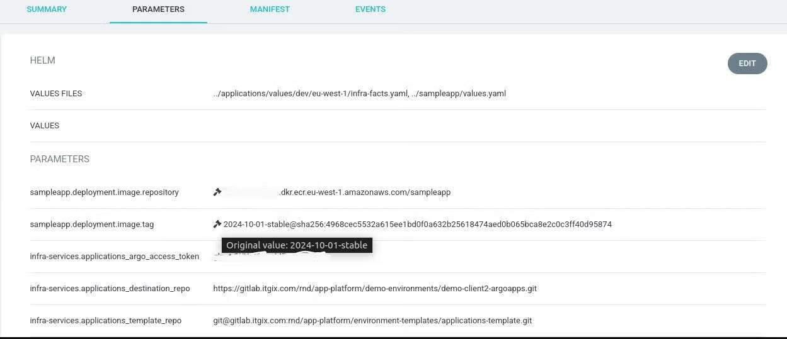

An update strategy specifies how Argo CD Image Updater identifies new image versions for updates. It supports various strategies for tracking and updating configured images. Each image can have its update strategy, with the default being the semver strategy.

The currently supported update strategies are:

- semver: Updates based on semantic versioning.

- latest: Updates to the most recently built image in the registry.

- digest: Updates to the latest version of a tag using its SHA digest.

- name: Sorts tags alphabetically and updates to the highest version.

In the examples below we show how to annotate our **argocd** applications to enable Argo CD Image Updater, setting up all update strategies. We are using an umbrella Helm chart to deploy our sample application. For Helm applications with multiple images in the manifest or when parameters other than **image.name** and **image.tag** are used to define images, you need to configure an **<image_alias>** in the image specification. This alias helps identify the image and enables the Ago CD Image Updater: 

```
argocd-image-updater.argoproj.io/image-list: "<image_alias>=<some/image>"
```

## semver update strategy:

This is the default update strategy. Via the semver strategy, Argo CD Image Updater operates with images tagged in the semantic versioning format. Tags should include semver-compatible identifiers in the structure X.Y.Z, where X, Y, and Z are whole numbers. An optional prefix of “v” (for example, vX.Y.Z) can be used, and both formats are considered equivalent. In this first example, each annotation is specifically explained because we are using some of the annotations for the semver update strategy in all examples.

Example annotations:

```yaml
apiVersion: argoproj.io/v1alpha1
kind: Application
metadata:
  name: sampleapp
  namespace: argocd
  annotations:
    argocd-image-updater.argoproj.io/image-list: "sampleapp=0.dkr.ecr.eu-west-1.amazonaws.com/sampleapp:v1.2.x"
    argocd-image-updater.argoproj.io/sampleapp.helm.image-name: "sampleapp.deployment.image.repository"
    argocd-image-updater.argoproj.io/sampleapp.helm.image-tag: "sampleapp.deployment.image.tag"
    argocd-image-updater.argoproj.io/sampleapp.update-strategy: "semver"
    argocd-image-updater.argoproj.io/pull-policy: Always
    argocd-image-updater.argoproj.io/write-back-method: argocd
```

- **image-list** – as we explained earlier, the image-list annotation enables Argo CD Image Updater to operate with the application – for the value we are using sampleapp as alias and we are specifying the image and its tag

- **image-name** – we are specifying the image name via its helm values path, where we are defining the image repository

- **image-tag** – defines the image tag via its helm values path

- **update-strategy** – here we are declaring the desired update strategy

- **pull-policy** – specifying the pull-policy, in this case, we are always getting the latest version

- **write-back-method** – specifying the Argo CD Image Updater write-back-method

In this scenario, we are using a semantic versioning constraint with the tag v1.2.x. This means that Argo CD Image Updater will look for any image tag that matches the v1.2.x pattern. The x in semantic versioning acts as a wildcard, so the updater will accept any patch-level version within the v1.2 series (e.g., v1.2.1, v1.2.5, v1.2.9, etc.).

Here is part of the helm **values** file that we are using for the **sampleapp** which is connected to the annotations:

```yaml
sampleapp:
  appId: sampleapp
  deployment:
    enabled: true
    image:
      repository: "000000000000.dkr.ecr.eu-west-1.amazonaws.com/sampleapp"
      tag: "v1.2"
      digest: true
      pullPolicy: "Always"
```

## latest upadte strategy:

Argo CD Image Updater can update the image with the most recent build date, even if the tag is arbitrary (like a Git commit SHA or random string). It focuses on the build date, not when the image was tagged or pushed to the registry. If multiple tags share the same build date, the updater sorts the tags in descending lexical order and selects the last one.

Example annotations:

```yaml
apiVersion: argoproj.io/v1alpha1
  kind: Application
  metadata:
    name: sampleapp
    namespace: argocd
    annotations:
      argocd-image-updater.argoproj.io/image-list: "sampleapp=0.dkr.ecr.eu-west-1.amazonaws.com/sampleapp"
      argocd-image-updater.argoproj.io/sampleapp.helm.image-name: "sampleapp.deployment.image.repository"
      argocd-image-updater.argoproj.io/sampleapp.update-strategy: "latest"
      argocd-image-updater.argoproj.io/pull-policy: Always
      argocd-image-updater.argoproj.io/write-back-method: argocd
```

In this scenario, we don’t have to specify **image-tag**. But if we want to allow only particular tags for update, we can use the **argocd-image-updater.argoproj.io/myimage.allow-tags:** annotation, for example with **latest** and **master** tags:

**argocd-image-updater.argoproj.io/myimage.allow-tags:** **latest**, **master**

or we can ignore them with the **ignore-tags** annotation:

**argocd-image-updater.argoproj.io/myimage.ignore-tags:** **latest**, **master**

Here is part of the helm **values** file that we are using for the **sampleapp** which is connected to the annotations:

```yaml
sampleapp:
  appId: sampleapp
  deployment:
    enabled: true
    image:
      repository: "000000000000.dkr.ecr.eu-west-1.amazonaws.com/sampleapp"
      tag: "latest" #in this case tag will be ignored
      digest: true
      pullPolicy: "Always"
```


## digest update strategy:

This update strategy monitors a specified tag in the registry for any changes and updates the image when a difference from the previous state is detected using the image SHA digest. The tag must be defined as a version constraint in the image list. It’s ideal for tracking mutable tags like the **latest** or environment-specific tags (e.g., **dev**, **stage**, **prod**) generated by a CI system.

Example annotations:

```yaml
apiVersion: argoproj.io/v1alpha1
kind: Application
metadata:
  name: sampleapp
  namespace: argocd
  annotations:
    argocd-image-updater.argoproj.io/image-list: "sampleapp=0.dkr.ecr.eu-west-1.amazonaws.com/sampleapp:latest"
    argocd-image-updater.argoproj.io/sampleapp.helm.image-name: "sampleapp.deployment.image.repository"
    argocd-image-updater.argoproj.io/sampleapp.helm.image-tag: "sampleapp.deployment.image.tag"
    argocd-image-updater.argoproj.io/sampleapp.update-strategy: "digest"
    argocd-image-updater.argoproj.io/pull-policy: Always
    argocd-image-updater.argoproj.io/write-back-method: argocd
```

Here is part of the helm **values** file that we are using for the **sampleapp** which is connected to the annotations – the important thing here is to specify the image tag in the format **tag: "tag_name@sha256"** :

```yaml
sampleapp:
appId: sampleapp
deployment:
  enabled: true
  image:
    repository: "000000000000.dkr.ecr.eu-west-1.amazonaws.com/sampleapp"
    tag: "latest@sha256:ef8049179764ee395542a9895dbc3e326b6526116672aea568cfb0a33c0912af"
     digest: true
     pullPolicy: "Always"
```

## name update strategy:

This updated strategy sorts image tags lexically in descending order and selects the last tag for updating. It’s useful for tracking images using calver versioning (e.g., YYYY-MM-DD) or similar tags. By default, all tags in the repository are considered, but you can configure it to limit which tags are eligible for updates.

Example annotations:

```yaml
apiVersion: argoproj.io/v1alpha1

kind: Application

metadata:
  name: sampleapp
  namespace: argocd
  annotations:
    argocd-image-updater.argoproj.io/image-list: "sampleapp=0.dkr.ecr.eu-west-1.amazonaws.com/sampleapp:latest"
    argocd-image-updater.argoproj.io/sampleapp.helm.image-name: "sampleapp.deployment.image.repository"
    argocd-image-updater.argoproj.io/sampleapp.update-strategy: "name"
    argocd-image-updater.argoproj.io/myapp.allow-tags: regexp:^[0-9]{4}-[0-9]{2}-[0-9]{2}-stable$
    argocd-image-updater.argoproj.io/pull-policy: "Always"

    argocd-image-updater.argoproj.io/write-back-method: "argocd"
```

In this case, if we have tags such as: **2024-09-30-stable, 2024-09-30-beta, 2024-10-01-beta, 2024-10-01-stable, master, latest** – Argo CD Image Updater will consider only the **-stable** ending tags, sort them lexically and choose the 2024-10-01-stable tag for the update.

Here is part of the helm **values** file that we are using for the sampleapp which is connected to the annotations:

```yaml
sampleapp:
  appId: sampleapp
  deployment:
    enabled: true
    image:
      repository: "000000000000.dkr.ecr.eu-west-1.amazonaws.com/sampleapp"
      tag: "2024-09-30-stable" #will be ignored in this case
      digest: true
      pullPolicy: "Always"
```


After we’ve made the needed configurations and selected the most suitable update strategy, we can check the Argo CD application’s parameters through the UI:



As we can see, after the new image version was pushed in ECR, the original value of the image tag was changed by the Argo CD image updater, and the new image was deployed!