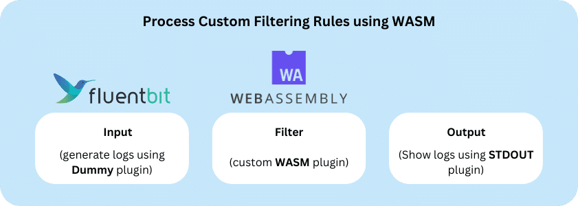

In enterprise environments, logs often contain critical information that requires immediate action. However, in the new cloud-first and cloud native world we may have hundreds of applications producing data across a distributed environment, making it difficult to identify where a problem is coming from.

This is where enriching logs can help. A common use case for enrichment is Kubernetes logs, which can exist across any number of nodes in a cluster. Pinpointing an issue can become incredibly difficult if we run 15 instances of that application in a cluster.

With [Fluent Bit](https://fluentbit.io/), we can enrich log data as it is collected with information such as geography and location. By providing the namespace, pod, and container ID, we can better troubleshoot and locate issues. Fluent Bit also provides enrichment filters that allow adding/removing fields or modifying static values of a field, such as the [Expect](https://docs.fluentbit.io/manual/pipeline/filters/expect), [Grep](https://docs.fluentbit.io/manual/pipeline/filters/grep), [Record Modifier](https://docs.fluentbit.io/manual/pipeline/filters/record-modifier), and [Modify](https://docs.fluentbit.io/manual/pipeline/filters/modify) filters. However, these filters only support modifying static values.

There is an increasing number of use cases where you can do more than modify static values, such as calling third-party data sources or adding context based on dynamic or new data. This is where WASM comes in. WASM supports retrieving values from APIs and performing calculations on the fly. With WASM, you can write programming statements directly in your processing pipeline.

The [Fluent Bit WASM plugin](https://docs.fluentbit.io/manual/pipeline/filters/wasm) can create a filter that incorporates logical and arithmetic operations, spanning several expressions — providing the capabilities we utilize in conventional programming.

With this use case in mind, let’s write a WASM program for Fluent Bit.
