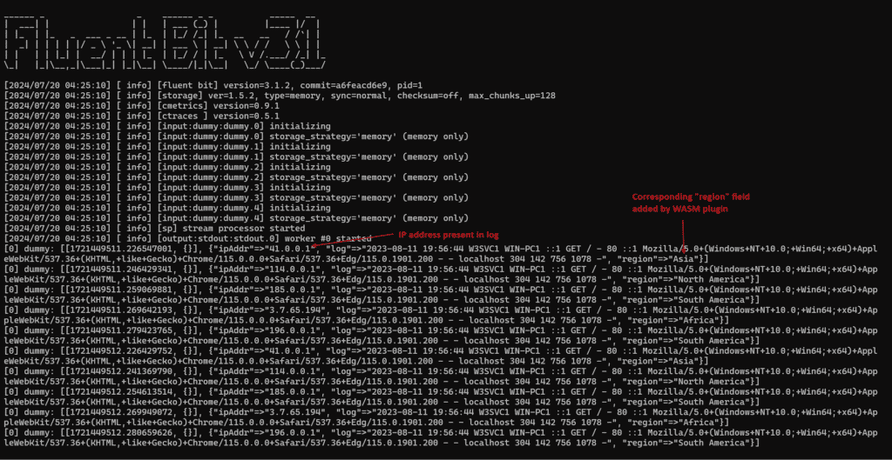

1. **Create the Configuration File**

    Create a file called fluent-bit.conf with the following content:

    ```bash
    [INPUT]
       Name            dummy
       Dummy           {"ipAddr":"41.0.0.1","log": "2023-08-11 19:56:44 W3SVC1 WIN-PC1 ::1 GET / - 80 ::1 Mozilla/5.0+(Windows+NT+10.0;+Win64;+x64)+AppleWebKit/537.36+(KHTML,+like+Gecko)+Chrome/115.0.0.0+Safari/537.36+Edg/115.0.1901.200 - - localhost 304 142 756 1078 -"}
       Tag             dummy

    [INPUT]
       Name            dummy
       Dummy           {"ipAddr":"114.0.0.1","log": "2023-08-11 19:56:44 W3SVC1 WIN-PC1 ::1 GET / - 80 ::1 Mozilla/5.0+(Windows+NT+10.0;+Win64;+x64)+AppleWebKit/537.36+(KHTML,+like+Gecko)+Chrome/115.0.0.0+Safari/537.36+Edg/115.0.1901.200 - - localhost 304 142 756 1078 -"}
       Tag             dummy

    [INPUT]
       Name            dummy
       Dummy           {"ipAddr":"185.0.0.1","log": "2023-08-11 19:56:44 W3SVC1 WIN-PC1 ::1 GET / - 80 ::1 Mozilla/5.0+(Windows+NT+10.0;+Win64;+x64)+AppleWebKit/537.36+(KHTML,+like+Gecko)+Chrome/115.0.0.0+Safari/537.36+Edg/115.0.1901.200 - - localhost 304 142 756 1078 -"}
       Tag             dummy

    [INPUT]
       Name            dummy
       Dummy           {"ipAddr":"3.7.65.196","log": "2023-08-11 19:56:44 W3SVC1 WIN-PC1 ::1 GET / - 80 ::1 Mozilla/5.0+(Windows+NT+10.0;+Win64;+x64)+AppleWebKit/537.36+(KHTML,+like+Gecko)+Chrome/115.0.0.0+Safari/537.36+Edg/115.0.1901.200 - - localhost 304 142 756 1078 -"}
       Tag             dummy

    [INPUT]
       Name            dummy
       Dummy           {"ipAddr":"196.0.0.1","log": "2023-08-11 19:56:44 W3SVC1 WIN-PC1 ::1 GET / - 80 ::1 Mozilla/5.0+(Windows+NT+10.0;+Win64;+x64)+AppleWebKit/537.36+(KHTML,+like+Gecko)+Chrome/115.0.0.0+Safari/537.36+Edg/115.0.1901.200 - - localhost 304 142 756 1078 -"}
       Tag             dummy

    [FILTER]
       Name            wasm
       match           dummy
       WASM_Path       /fluent-bit/etc/filter.wasm
       Function_Name   go_filter

    [OUTPUT]
       name            stdout
       match           dummy
    ```

2. **Override the Default Configuration**

    Execute the following command to run Fluent Bit in a Docker container, ensure the filter.wasm binary exists in the current directory where you are running the command.

    ```bash
    docker run \\
     -v $(pwd)/filter.wasm:/fluent-bit/etc/filter.wasm \\
     -v $(pwd)/fluent-bit.conf:/fluent-bit/etc/fluent-bit.conf \\
     -ti cr.fluentbit.io/fluent/fluent-bit:3.1 \\
     /fluent-bit/bin/fluent-bit \\
     -c /fluent-bit/etc/fluent-bit.conf
    ```

3. Verify Fluent Bit Logs

    The Fluent Bit container will emit logs; you should be able to view the modified region as shown in the following image:

    

To programmatically verify plugin results, you can use the Expect filter. You can read more at [Validating Your Data and Structure](https://docs.fluentbit.io/manual/local-testing/validating-your-data-and-structure).
