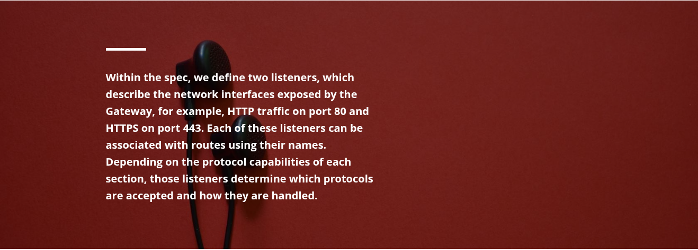
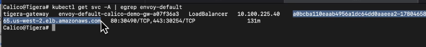
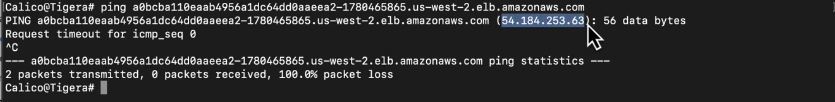
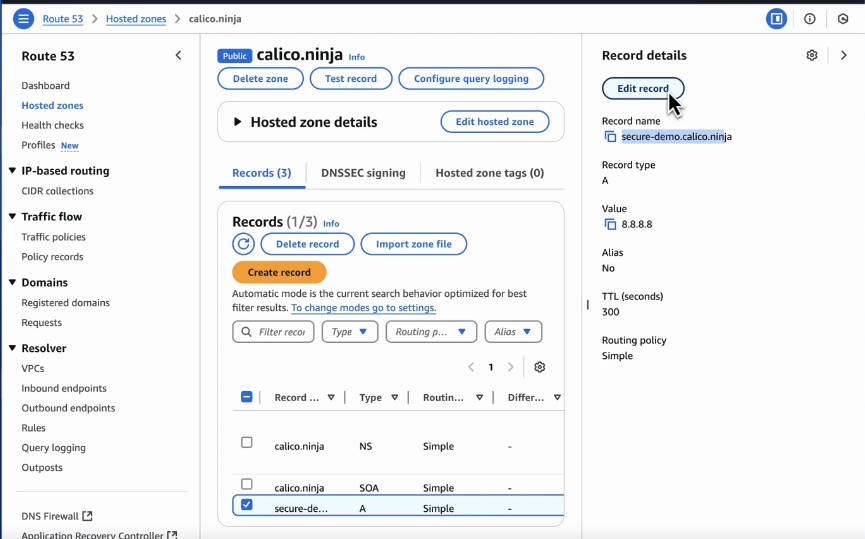
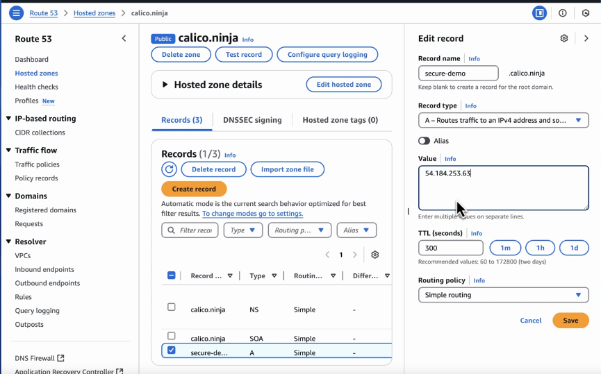
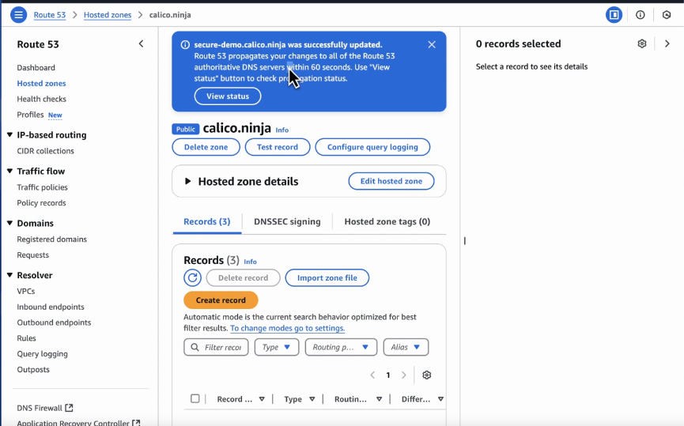
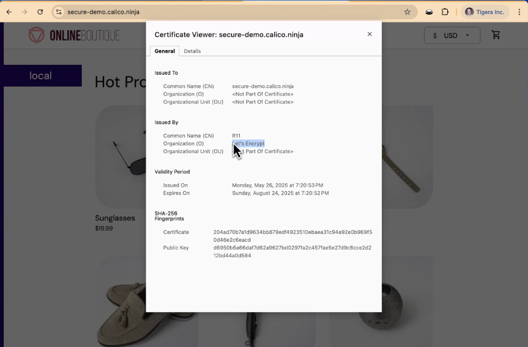

### Configuring Gateway API Resources for Traffic Management


In our example, we need to create two key Gateway API resources.

#### Gateway

The Gateway resource defines the cluster’s entry point for external traffic,
something typically owned and managed by the platform or infrastructure team. It
specifies a **gatewayClassName** (in our case, **tigera-gateway-class**),
signaling that Calico’s Ingress Gateway should manage this Gateway instance.



Create a gateway:

```bash
kubectl create -f - <<EOF
apiVersion: gateway.networking.k8s.io/v1
kind: Gateway
metadata:
  annotations:
    cert-manager.io/cluster-issuer: letsencrypt
  name: calico-demo-gw
spec:
  gatewayClassName: tigera-gateway-class
  listeners:
    - name: http
      protocol: HTTP
      port: 80
    - name: https
      protocol: HTTPS
      port: 443
      hostname: <REPLACE_WITH_YOUR_DOMAIN>
      tls:
        mode: Terminate
        certificateRefs:
        - kind: Secret
          group: ""
          name: secure-demo-cert
EOF
```

When a Gateway is created, it triggers the provisioning of a Kubernetes
LoadBalancer Service, making the Gateway accessible to external clients. You can
confirm this by listing your cluster services inside the **'tigera-gateway'**
namespace named **'envoy-default-calico-demo-gw-xxxxxxx'.**

> **warnings** At this stage, we need to add the Calico Ingress Gateway IP to the domain A record that we added in the https section. Keep in mind that different domain registrars have different methods for updating DNS records.

```bash
kubectl get svc -A | egrep envoy-default
```

you will get



take out link and ping



Copy Ip and edit you record



Put you Copied Ip



And done



**Now check your site**



