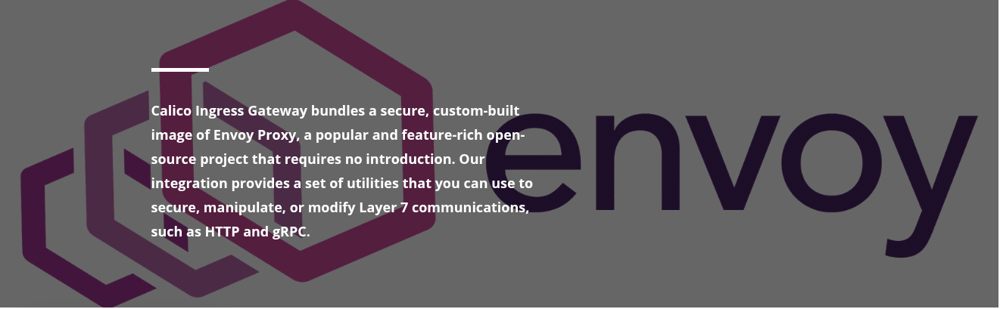

### Activating Calico Ingress Gateway with Envoy Proxy

Now, let's switch on the Calico Ingress Gateway. We achieve this by applying a Gateway API CR. Remember, this CR belongs to the Tigera operator (**operator.tigera.io/v1**) and acts as the **'on'** switch. Creating it tells the operator to deploy its managed Envoy Proxy, which will handle our incoming traffic. Calico uses Envoy as its engine for implementing the official Kubernetes Gateway API standard, giving us access to powerful routing and security features.

Enable Calico Ingress Gateway capabilities:

```bash
kubectl create -f - <<EOF
apiVersion: operator.tigera.io/v1
kind: GatewayAPI
metadata:
  name: default
EOF
```

This Calico-specific Gateway API resource is the essential prerequisite for using Kubernetes Gateway API standard objects. 

Let's check the deployment status:

```bash
kubectl wait --for=condition=Available tigerastatus gatewayapi
```

To ensure the Envoy deployment is fully up and running before we proceed, we wait for the previous command to report back "condition met."


