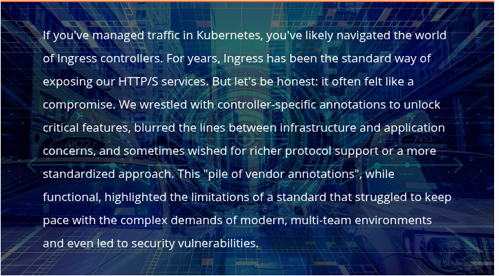

### Understanding the Evolution from Ingress to Gateway API

# The Ingress Rut

The Ingress controller landscape is a mishmash of vendors with great ideas. While they all can route HTTP/S traffic into your cluster, expanding your services to include other protocols puts you at the mercy of that vendor and the capabilities that they implement. Additionally, if you attempt to migrate from your old Ingress Controller to a new one at some point, there is the concern of vendor lock-in, which ties your hands. If you are wondering how vendor lock-in plays a role, take a closer look at your Ingress resources. Don't they all share some sort of annotation?

That "pile of vendor annotations," while functional, is specific to that one great solution you are currently using, highlighting the limitations of a standard that struggled to keep pace and even led to [security vulnerabilities](https://kubernetes.io/blog/2025/03/24/ingress-nginx-cve-2025-1974/).

## What Are We Covering?

While Ingress isn’t disappearing tomorrow, the direction is clear. The Gateway API offers a path to a more robust, secure, and manageable ingress strategy. And now, with Calico v3.30, we’re introducing the Calico Ingress Gateway, a powerful, Envoy-based implementation of this next-generation standard at your fingertip.

This microcourse guides you through the settings and basic configurations required to run a secure website deployment. We’ll set up the Calico Ingress Gateway, demonstrate its core concepts in action, and show you how to effortlessly secure your applications with automated TLS certificates and enforced HTTPS, leaving those annotation struggles behind.

## What Makes Gateway API Different?

There are three main points we should highlight when evaluating Gateway API and Ingress controllers.