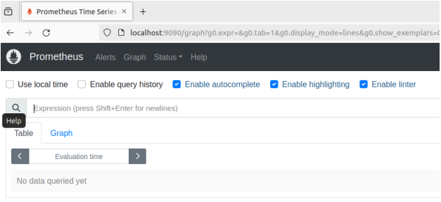
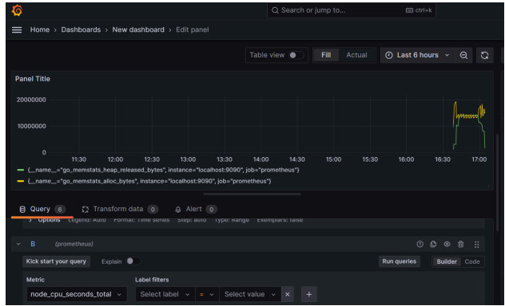

Set up the Prometheus server on an Ubuntu machine.

1. Download the latest Prometheus release, by executing the following command.

```bash
$ cd /tmp
$ curl -LO
https://github.com/prometheus/prometheus/releases/download/v2.49.1/pr
ometheus-2.49.1.linux-amd64.tar.gz
```

2. Extract the contents by executing the following command.

```bash
$ tar xvf prometheus-2.49.1.linux-amd64.tar.gz
prometheus-2.49.1.linux-amd64/
prometheus-2.49.1.linux-amd64/NOTICE
prometheus-2.49.1.linux-amd64/LICENSE
prometheus-2.49.1.linux-amd64/prometheus
prometheus-2.49.1.linux-amd64/consoles/
prometheus-2.49.1.linux-amd64/consoles/prometheus-overview.html
prometheus-2.49.1.linux-amd64/consoles/node-cpu.html
prometheus-2.49.1.linux-amd64/consoles/node.html
prometheus-2.49.1.linux-amd64/consoles/prometheus.html
prometheus-2.49.1.linux-amd64/consoles/index.html.example
prometheus-2.49.1.linux-amd64/consoles/node-overview.html
prometheus-2.49.1.linux-amd64/consoles/node-disk.html
prometheus-2.49.1.linux-amd64/prometheus.yml
prometheus-2.49.1.linux-amd64/promtool
prometheus-2.49.1.linux-amd64/console_libraries/
prometheus-2.49.1.linux-amd64/console_libraries/menu.lib
prometheus-2.49.1.linux-amd64/console_libraries/prom.lib
```

3. Move the extracted binaries to the bin folder by executing the below commands.

```bash
sudo mv prometheus-2.49.1.linux-amd64/prometheus /usr/local/bin/
sudo mv prometheus-2.49.1.linux-amd64/promtool /usr/local/bin/
```

4. Create a directory for the Prometheus configuration file and make use of the default
configuration.

```bash
$ sudo mkdir /etc/prometheus
$ sudo mv prometheus-2.49.1.linux-amd64/prometheus.yml
/etc/prometheus/prometheus.yml
```

5. Create a user for Prometheus. It's always a good practice to run services using a dedicated
user.

```bash
sudo useradd --no-create-home --shell /bin/false prometheus
```

6. Set ownership, make Prometheus own its files.

```bash
sudo chown prometheus:prometheus /usr/local/bin/prometheus
sudo chown prometheus:prometheus /usr/local/bin/promtool
sudo chown -R prometheus:prometheus /etc/prometheus
```

7. To allow Prometheus to run as a service, create a systemd service file:

```bash
cat > /etc/systemd/system/prometheus.service << EOF
[Unit]
Description=Prometheus
Wants=network-online.target
After=network-online.target
[Service]
User=prometheus
Group=prometheus
Type=simple
ExecStart=/usr/local/bin/prometheus \
--config.file /etc/prometheus/prometheus.yml \
--storage.tsdb.path /etc/prometheus/ \
--web.listen-address=0.0.0.0:9090
[Install]
WantedBy=multi-user.target
EOF
```

8. Enable and start the Prometheus service:

```bash
$ sudo systemctl daemon-reload
$ sudo systemctl start prometheus
$ sudo systemctl enable prometheus
Created symlink
/etc/systemd/system/multi-user.target.wants/prometheus.service →
/etc/systemd/system/prometheus.service.
```

9. Verify if you are able to access the service by opening the browser and executing
<http://localhost:9090>



10. Let us install Grafana, add the apt Grafana repository and the GPG key to verify the
packages.

```bash
$ sudo apt-get install -y apt-transport-https
software-properties-common wget
$ sudo mkdir -p /etc/apt/keyrings/
wget -q -O - https://apt.grafana.com/gpg.key | gpg --dearmor | sudo
tee /etc/apt/keyrings/grafana.gpg > /dev/null
$ echo "deb [signed-by=/etc/apt/keyrings/grafana.gpg] https://apt.grafana.com
stable main" | sudo tee -a /etc/apt/sources.list.d/grafana.list
```

11. Install Grafana by executing the following command:

```bash
$ sudo apt-get -y update
$ sudo apt-get install -y Grafana
student@ubuntu:~# sudo apt-get install -y grafana
Reading package lists... Done
Building dependency tree
Reading state information... Done
The following additional packages will be installed:
fontconfig-config fonts-dejavu-core libfontconfig1 musl
The following NEW packages will be installed:
fontconfig-config fonts-dejavu-core grafana libfontconfig1 musl
0 upgraded, 5 newly installed, 0 to remove and 14 not upgraded.
Need to get 107 MB of archives.
After this operation, 395 MB of additional disk space will be used.
Get:1 http://azure.archive.ubuntu.com/ubuntu focal/main amd64
fonts-dejavu-core all 2.37-1 [1041 kB]
Get:2 http://azure.archive.ubuntu.com/ubuntu focal/main amd64
fontconfig-config all 2.13.1-2ubuntu3 [28.8 kB]
Get:3 http://azure.archive.ubuntu.com/ubuntu focal/main amd64
libfontconfig1 amd64 2.13.1-2ubuntu3 [114 kB]
Get:4 http://azure.archive.ubuntu.com/ubuntu focal/universe amd64 musl
amd64 1.1.24-1 [377 kB]
Get:5 https://packages.grafana.com/oss/deb stable/main amd64 grafana
amd64 10.3.3 [106 MB]
Fetched 107 MB in 3s (31.8 MB/s)
Selecting previously unselected package fonts-dejavu-core.
(Reading database ... 84578 files and directories currently
installed.)
Preparing to unpack .../fonts-dejavu-core_2.37-1_all.deb ...
Unpacking fonts-dejavu-core (2.37-1) ...
Selecting previously unselected package fontconfig-config.
Preparing to unpack .../fontconfig-config_2.13.1-2ubuntu3_all.deb ...
Unpacking fontconfig-config (2.13.1-2ubuntu3) ...
Selecting previously unselected package libfontconfig1:amd64.
Preparing to unpack .../libfontconfig1_2.13.1-2ubuntu3_amd64.deb ...
Unpacking libfontconfig1:amd64 (2.13.1-2ubuntu3) ...
Selecting previously unselected package musl:amd64.
Preparing to unpack .../musl_1.1.24-1_amd64.deb ...
Unpacking musl:amd64 (1.1.24-1) ...
Selecting previously unselected package grafana.
Preparing to unpack .../grafana_10.3.3_amd64.deb ...
Unpacking grafana (10.3.3) ...
Setting up fonts-dejavu-core (2.37-1) ...
Setting up musl:amd64 (1.1.24-1) ...
Setting up fontconfig-config (2.13.1-2ubuntu3) ...
Setting up libfontconfig1:amd64 (2.13.1-2ubuntu3) ...
Setting up grafana (10.3.3) ...
Adding system user `grafana' (UID 116) ...
Adding new user `grafana' (UID 116) with group `grafana' ...
Not creating home directory `/usr/share/grafana'.
### NOT starting on installation, please execute the following
statements to configure grafana to start automatically using systemd
sudo /bin/systemctl daemon-reload
sudo /bin/systemctl enable grafana-server
### You can start grafana-server by executing
sudo /bin/systemctl start grafana-server
Processing triggers for systemd (245.4-4ubuntu3.23) ...
Processing triggers for man-db (2.9.1-1) ...
Processing triggers for libc-bin (2.31-0ubuntu9.14) ...
```

12. Start and enable Grafana by executing the below command:

```bash
$ sudo systemctl start grafana-server
$ sudo systemctl enable grafana-server
Synchronizing state of grafana-server.service with SysV service script
with /lib/systemd/systemd-sysv-install.
Executing: /lib/systemd/systemd-sysv-install enable grafana-server
Created symlink
/etc/systemd/system/multi-user.target.wants/grafana-server.service →
/lib/systemd/system/grafana-server.service.
```

13. Configure Grafana to use Prometheus:

- Access Grafana web interface. Open your web browser and go to <http://localhost:3000>. The default login is admin for both username and password.


- Add Prometheus as a Data Source. Go to "Connections" > "Data Sources" > "Add Data Source". Select "Prometheus" as the type. For the URL, enter <http://localhost:9090> and click "Save & Test".


Create a Dashboard. Now, you can create a new dashboard and add panels to
visualize metrics from Prometheus.

- In the panel configuration view, you’ll see a query editor. Since you've set Prometheus as the data source, it should be selected by default.
- In the Metrics field, you can write your Prometheus query. For example, if you want to monitor the CPU usage of a system, you might use a query like node_cpu_seconds_total. This metric and query depend on the data exposed to Prometheus. For a simple start, you can use up{job="prometheus"} which will show you the up/down status of Prometheus targets.
- After entering your query, you should see the graph update in real time below the query editor. Adjust the time range and graph settings as needed. You can set the title of the panel under the Panel title section by clicking on the title name at the top.
- Save the Panel
- Once you are satisfied with the configuration, click the Apply button in the upper right corner to add the panel to your dashboard.
- You will be taken back to the dashboard view where you can see your new panel. Click the Save dashboard icon at the top, give your dashboard a name, and optionally a folder and tags, then click Save.
- To further customize your dashboard, you can add more panels by clicking the + button in the dashboard view and selecting Add Panel. Repeat the steps above to configure additional panels as needed, each with its own Prometheus query for different metrics you want to monitor.


