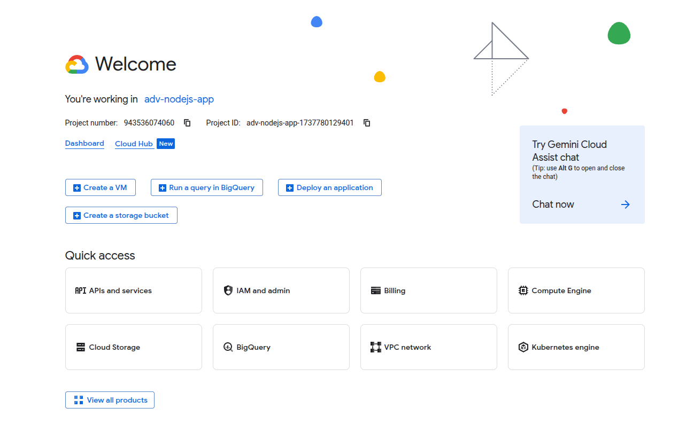
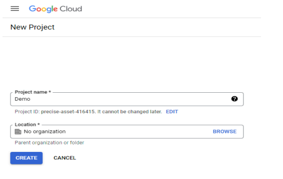
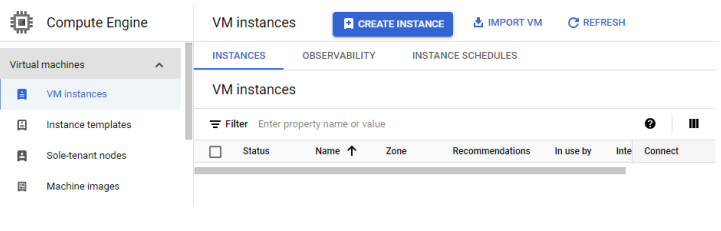
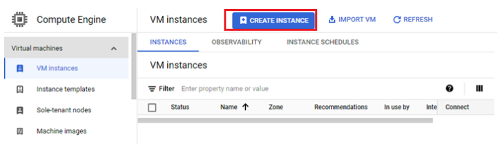
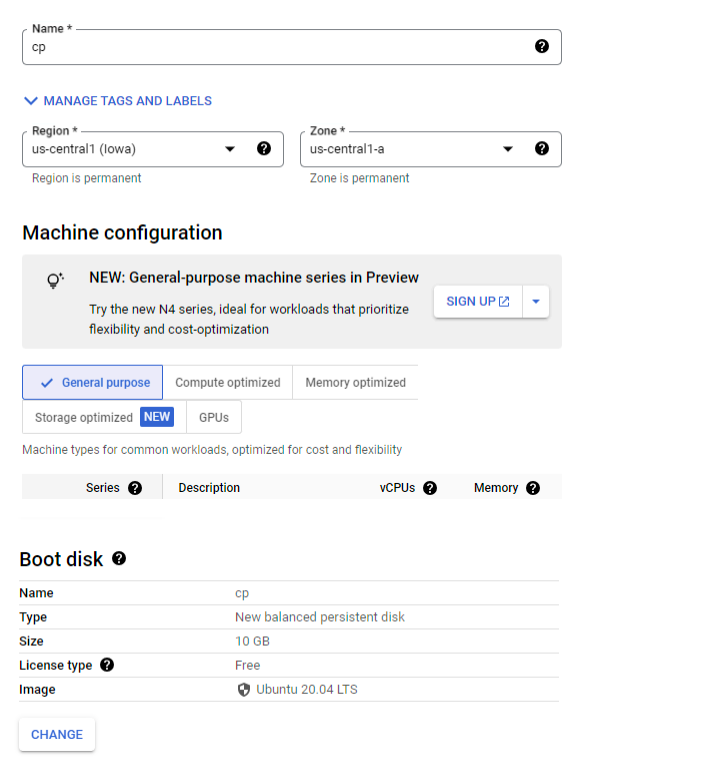
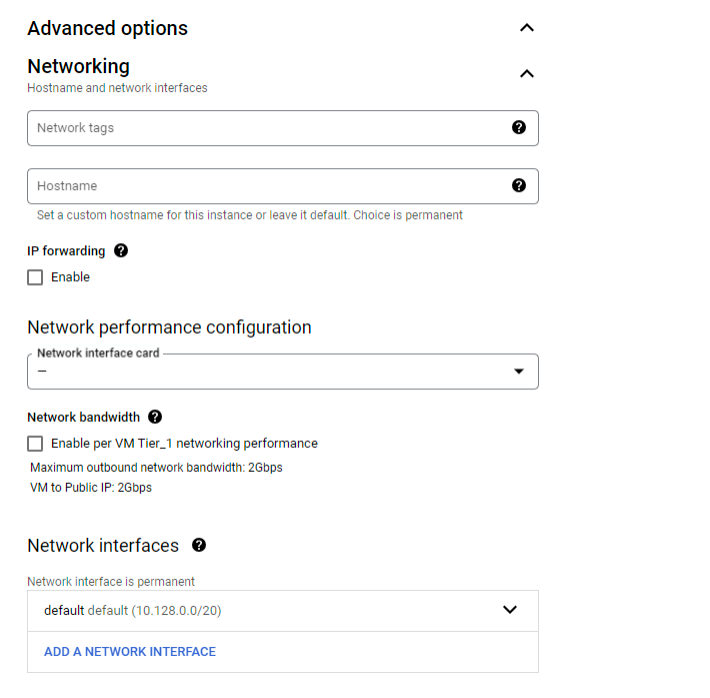
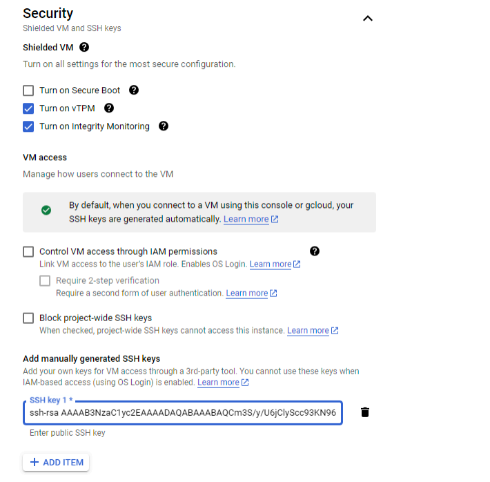
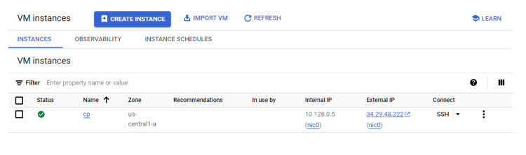

In this exercise, we will create a virtual machine with Ubuntu 20.04 as an operating system on GCP.

1. Sign in to [Google Cloud Console](https://console.cloud.google.com/?pli=1&inv=1&invt=Ab46wA) using the Google account. Open your web browser and navigate to the Google Cloud Console.

2. Select or Create a Project. If you have an existing project, select it from the drop-down menu at the top
of the console. Otherwise, click on the "Create Project" button and follow the prompts to create a new
project.

3. Navigate to Compute Engine: On the left-hand side of the console, click on the "Compute Engine" option
under the "Compute" section. This will take you to the Compute Engine dashboard.

4. On the Compute Engine dashboard, click on the "Create" button to start creating a new instance.

5. Configure Instance Details:

- Name: cp.
- Region and Zone: Choose the region and zone where you want to deploy your
instance. This choice may affect latency and pricing.
- Machine Type: Select the machine type for your instance. This determines the
amount of CPU and memory resources allocated to your instance.
- Boot Disk: Choose the operating system and disk size for your instance. You can
also specify custom images or snapshots if needed.

6. Under the "Firewall" section, you can configure network tags and firewall rules for your instance. By default,
SSH access is enabled. You may want to add additional rules depending on your requirements.

7. Configure Networking: You can configure networking options such as network tags, external IP addresses,
and network interfaces for your instance.

8. Add SSH Keys If you plan to connect to your instance via SSH, you can add your SSH public keys under
the "Management, security, disks, networking, sole tenancy" section.

9. Once you have configured all the necessary settings, click on the "Create" button at the bottom of the page
to create your instance. Wait for Provisioning, Google Cloud will now provision your Compute Engine instance.
This may take a few minutes depending on your configuration.

10. Access Your Instance: Once your instance is created, you can access it via SSH from the Google Cloud
Console or using an SSH client like PuTTY.
That's it! You've successfully created a Google Cloud Compute Engine instance. You can now start using your
instance to host applications, run workloads, or perform any other computing tasks you need.