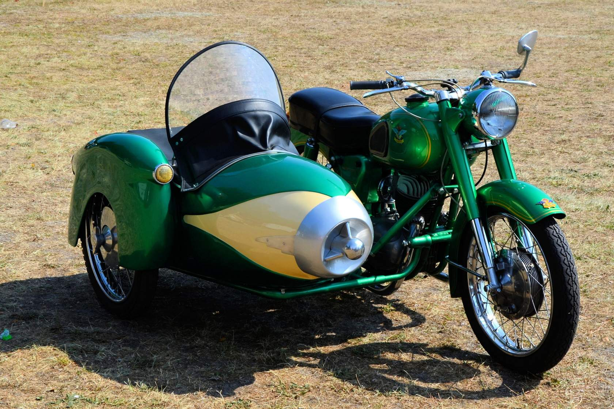

Think of a sidecar like a trusty companion motorcycle attachment. Historically, IT infrastructures have always used auxiliary services to handle critical tasks.

Before containers, we relied on background processes and helper daemons to manage logging, monitoring, and networking. The microservices revolution transformed this approach, making sidecars a structured and intentional architectural choice. With the rise of microservices, the sidecar pattern became more clearly defined, allowing developers to offload specific responsibilities from the main service without altering its code.
Service meshes, such as Istio and Linkerd, have popularized sidecar proxies, demonstrating how these companion containers can elegantly handle observability, security, and traffic management in distributed systems.

