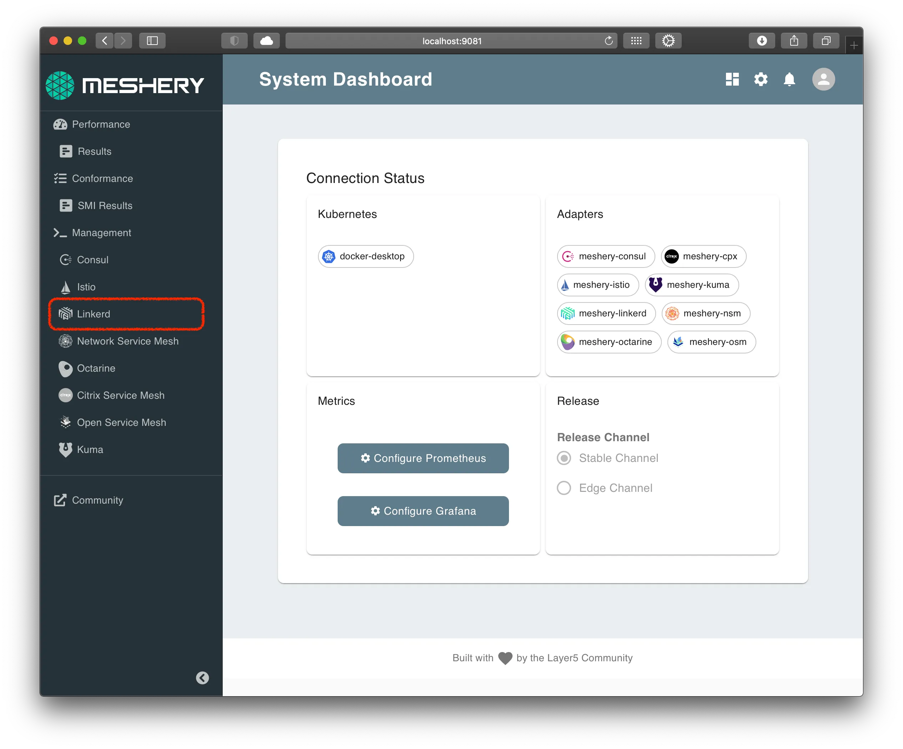
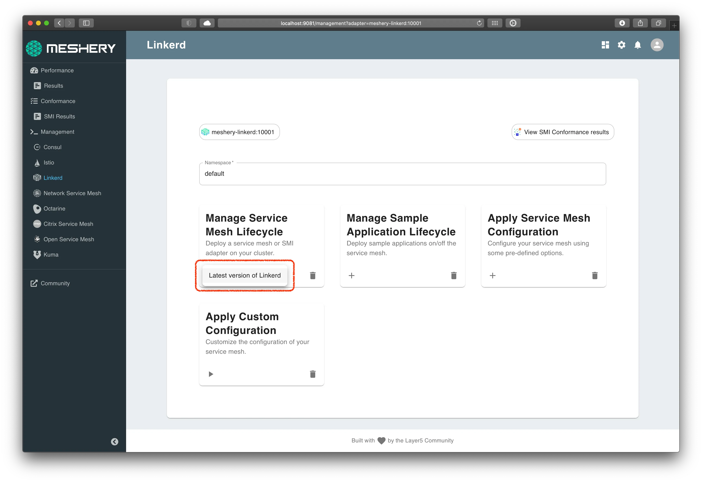

### Setup Linkerd

Now that we have a Kubernetes cluster and Meshery, we are ready to download and deploy Linkerd resources.

### Steps

#### **Install Linkerd**

Using Meshery, select Linkerd from the Management menu.


In the Linkerd management page:

- Type linkerd into the namespace field.
- Click the (+) icon on the Install card and select Latest Linkerd to install the latest version of Linkerd.



### Alternative: Manual Installation

Perform the below steps if the above steps doesn't work for you.

#### Download `linkerd` CLI

On a *nix system, you can setup linkerd by doing the following:

The above command will get the latest Linkerd package and untar it in the same folder.

Change into the Linkerd package directory and add the linkerd client to your PATH environment variable.

```bash
curl -sL https://run.linkerd.io/install | sh
export PATH=$PATH:$HOME/.linkerd2/bin
```

Alternatively, on MacOS you can sue HomeBrew to install linkerd

```bash
brew install linkerd
```

To verify linkerd is setup lets try to print out the command help

```bash
linkerd version
```

We can use a new feature in linkerd to check if the cluster is ready for install:

```bash
linkerd check --pre
```

Install Linkerd:
Deploy Linkerd custom resources:

```bash
linkerd install | kubectl apply -f -
```

#### Verify install

Linkerd is deployed in the linkerd Kubernetes namespace. Verify that Linkerd and its components are deployed, execute the command:

```bash
linkerd check
```

**Enforce mTLS strict mode**
By establishing mutually-authenticated connections between Linkerd proxies , Linkerd automatically enables mutual Transport Layer Security (mTLS) by default for most HTTP-based communication between services.

#### Confirming Add-ons

Linkerd, as part of this workshop, is installed with several optional addons like:

- Prometheus [site](https://prometheus.io/)
- Grafana [site](https://grafana.com/)
- Jaeger [site](https://www.jaegertracing.io/)
- Dashboard [site](https://linkerd.io/2.10/reference/architecture/#dashboard)

You will use Meshery for collecting and viewing metrics, and Jaeger for viewing distributed traces.
