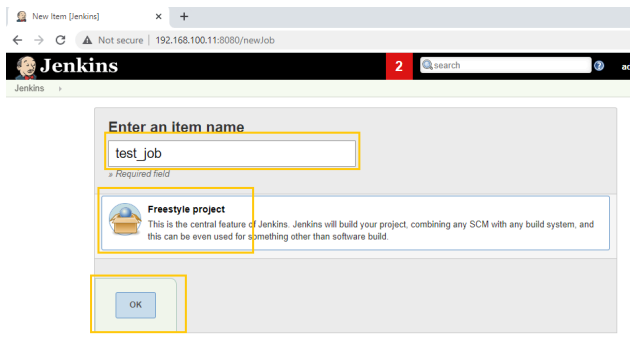

Jenkins provides hundreds of plugins to support building, deploying and automating any project.
As an extensible automation server, Jenkins can be used as a simple CI server or turned into
the continuous delivery hub for any project.
For simplicity’s sake, we will use Docker containers to set up the Jenkins server.
For other installation methods refer to the Jenkins documentation.
**Note: Ensure Docker is already installed on your machine.**
Set up Jenkins server on a Docker container and store Jenkins Home on Docker Volume.

1. Create the Jenkins container by executing the following command:

```bash
$ docker run --name myjenkins1 -dit -p 8080:8080 -p 50000:50000 -v
jenkins_data:/var/jenkins_home jenkins/jenkins:2.60.3-alpine
```

1. List the container running the following command:

```bash
docker container ls
```

1. View the logs and capture the initial admin password for Jenkins by executing the following
command:

```bash
docker logs myjenkins1| grep -B 5 initialAdminPassword
```

1. Access the Jenkins server and perform the initial configuration.
Open the browser and access the URL:<http://HostIP:8080> (curl ifconfig.io to
get your public IP).


1. Enter the initial admin password and click on continue:


1. Choose the “Select Plugins to install” option and click on “none”, then click on Install. The
initial installation does not contain any plugins by default. We can install plugins of our
choice. However, to keep it simple, we will choose “none” in this lab and move forward.


!

1. Admin user can be created during this step. We will skip the step and select “Continue as
admin” and proceed to the next step.


1. Jenkins is set up and ready to use. Click on Start using Jenkins to proceed further.


1. The initial admin password was generated during installation; reset the password of the
admin user and change it to one of your choice.


Update the Password and confirm.


1. Now that Jenkins is ready, create a new job to test the working on Jenkins.


1. Notice that there are no projects available; this is because we skipped installing additional
plugins during the setup. We can add plugins later, for now we will make use of the default
Freestyle Project plugin available and set up a test job to execute a command.



1. Under the Build section, select Execute shell to execute a command


1. Instead of creating a complex command, we are just executing a simple “ls” command. Type
“ls” in the command box, save and exit


1. On the Jenkins dashboard you will find the newly created Project test_job.


1. Click on Build Now on the left hand pane, to execute the command or to run the build


1. The build job is completed in a few seconds; click on the build number in build history to
view the console output, which displays the log output of the completed job.


1. Congratulations!!! You have successfully installed Jenkins, configured it, created and
executed a simple job on Jenkins.
If you like, go ahead and explore the Jenkins Server by adding new plugins and creating
pipelines.

2. Clean up by logging off the Jenkins Server, then stop and remove the myjenkins
container, by executing the following commands.

```bash
docker container stop myjenkins1
docker container rm myjenkins1
docker container rm `docker container ls -a -q` -f
docker image rm `docker image ls -q` -f
docker volume prune -f
```
