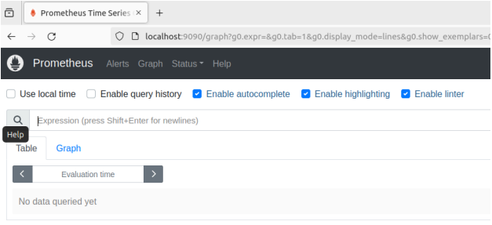
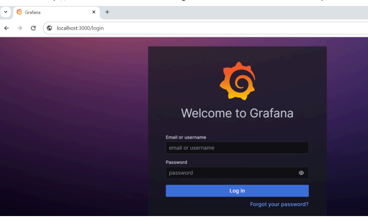
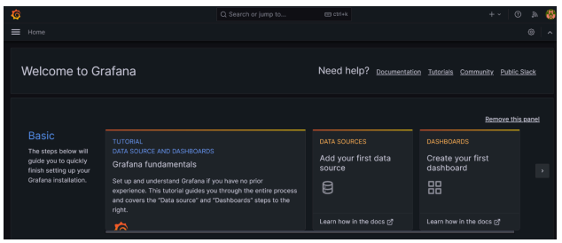
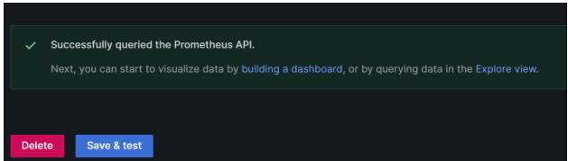
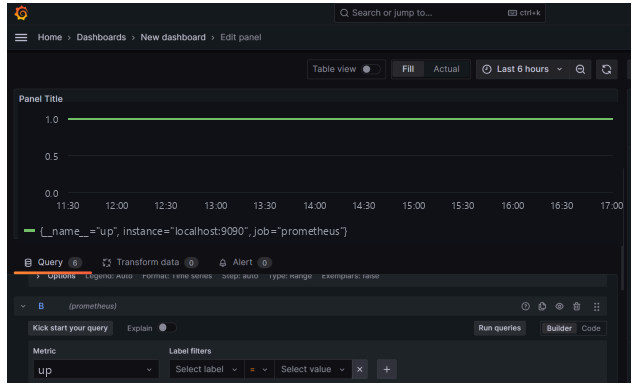

[Prometheus](https://prometheus.io/) is an open-source systems monitoring and
alerting toolkit, and [Grafana](https://grafana.com/) is an open-source
analytics and interactive visualization web application.

Having
[Prometheus](https://prometheus.io/docs/prometheus/latest/installation/)
and
[Grafana](https://grafana.com/docs/grafana/latest/setup-grafana/installation/)
installed and running on your host is a prerequisite for this exercise.

## Service Architecture and Security Concepts

When configuring Prometheus in production environments, consider the following
operational standards:

- **Dedicated Service User:** In host-based or production deployments, run
  Prometheus under a dedicated non-root service account (such as `prometheus`).
  Running background services under isolated users is a security best practice
  that enforces least-privilege access.
- **Service Management:** On Linux systems using systemd, create a service
  unit file at `/etc/systemd/system/prometheus.service` to run Prometheus as a
  background service managed by the operating system, and enable it via
  `systemctl`.

## Hands-on Exercise: Connecting Prometheus and Grafana

1. Verify that your Prometheus server is accessible by navigating to
   <http://localhost:9090> in your web browser (port `9090` is the default web
   interface port for Prometheus):

1. Access the Grafana web interface by navigating to <http://localhost:3000> in
   your web browser. The default login credentials are `admin` for both username
   and password:

1. Add Prometheus as a Data Source in Grafana:
   - In the Grafana sidebar, navigate to **Connections** > **Data Sources** >
     **Add data source**.
   - Select **Prometheus** as the data source type.
   - In the connection settings, set the Prometheus server URL to
     `http://localhost:9090` (or `http://host.docker.internal:9090` if running
     Grafana in Docker Desktop).
   - Click **Save & test** to verify connectivity between Grafana and
     Prometheus.

1. Create a dashboard to visualize metrics from Prometheus:
   - In the panel configuration view, select Prometheus as your data source.
   - In the metric query field, enter a PromQL query such as `up` to monitor
     target health across all endpoints, or `up{job="prometheus"}` (assuming
     a scrape job named `prometheus` is configured, which is Prometheus's
     default configuration).
   - Adjust the time range and visualization settings as needed, and assign a
     title to your panel under panel settings.
   - Click **Apply** in the upper right corner to add the panel to your
     dashboard.
   - Click the **Save** icon at the top of the page, specify a dashboard title,
     and save your dashboard.
   - You can add additional panels by clicking **Add Panel** to monitor
     different application and infrastructure metrics.

